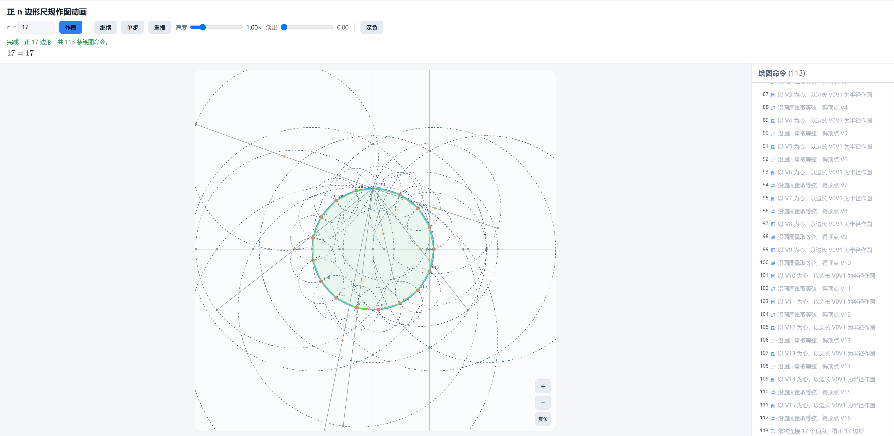

# 正 n 边形尺规作图动画

输入一个正整数 `n`，本程序判断正 `n` 边形能否用**尺规作图**；若能，则从一个圆开始，
实时动画演示整条作图过程。后端用 Python 做**纯代数**计算并输出一串**绘图命令**，前端用
HTML Canvas 把命令逐帧画出来——右侧的命令列表与左侧的动画**一一对应、实时同步**，而不是
先渲染成视频再播放。代码全部为英文，界面为中文。



> 正 17 边形的尺规作图（共 113 条绘图命令）。

---

## 一、数学原理

### 可作图判据（高斯–万策尔定理）

正 `n` 边形可用尺规作图，当且仅当

```
n = 2^k · (互不相同的费马素数之积)
```

已知的费马素数只有 5 个：**3, 5, 17, 257, 65537**。因此例如 9 = 3²（费马素数重复）、
7、11、13（非费马素数）都**不可**作图。

退化情形也支持：`n=1` 是单个点 (1,0)，`n=2` 是直径（端点 (1,0) 与 (−1,0)）。

### 构造方法

整个问题归结为：在单位圆上作出角 `2π/n` 处的一个顶点，然后用圆规把这条弦绕圆周量一圈，
得到全部顶点。作出第一个顶点的方法按 `n` 的结构递归进行：

- **费马素数 p**：用高斯周期理论把 `2cos(2π/p)` 表示成一串二次方程，每个二次方程
  `x² − s·x + q = 0` 用一个 **Carlyle 圆**求解（以 A=(0,1) 与 B=(s,q) 为直径的圆，
  它与水平轴的两个交点就是方程的两根）。
- **偶数 n = 2m**：先作出 `2π/m` 处的顶点，再二等分它与 V0 之间的弧。
- **奇合数 n = p·b**（p 为最小素因子，与 b 互素）：由 Bézout 等式 `u·p + v·b = 1`
  得 `2π/n = u·(2π/b) + v·(2π/p)`，把两个子多边形的弧按整数次叠加得到。

每个 Carlyle 圆的步骤被拆成**先计算、再作图**两个阶段：先显式算出 `s`（某个已作出点的
横坐标）和 `q`（已作出各点横坐标的整数组合，第一层为闭式 `−(p−1)/4`），再标出 B、连直径、
取中点为圆心、作圆、定出两个交点。

---

## 二、环境与安装

### 一键使用（推荐，无需自己装环境）

直接下载自带运行环境的完整包：

**[Straightedge-and-Compass-v1.0-full.zip](https://github.com/xuda-ye-math/Straightedge-and-Compass/releases/download/v1.0/Straightedge-and-Compass-v1.0-full.zip)**

它已经包含全部源码与 Linux / Windows 两个平台**装好依赖的虚拟环境**（以及 `data/` 预生成缓存），
解压后无需联网安装即可运行：

- **Windows**：解压后进入文件夹，**右键点击 `run_Windows.ps1` → 「使用 PowerShell 运行」**，
  它会自动启动服务器并打开浏览器。
- **Linux**：解压后在文件夹里运行 `./run_linux_amd64`。

> 若想自己手动搭建环境（而不是用上面的完整包），见下面各小节。

### 手动安装

只需要 **Python 3.9 及以上**。后端唯一的第三方依赖是 **`sympy`**（用于求原根、做精确代数；
`mpmath` 会随 `sympy` 一起装上）。前端与服务器只用标准库，**不需要任何额外依赖，也不需要
`numpy`**。

虚拟环境放在普通文件夹（非隐藏的点文件夹）里，并随仓库一起提供；用 `--copies` 创建时会把
**Python 可执行文件复制进该文件夹**（而非软链接），因此解释器自带其中。每个平台一个文件夹，
名字里标明平台：Linux 用 **`venv_linux_amd64`**，Windows 用 **`venv_Windows`**。

### Linux

```bash
# 1. 在项目根目录创建虚拟环境（--copies：把解释器复制进文件夹，自带 Python 可执行文件）
python3 -m venv --copies venv_linux_amd64

# 2. 安装依赖
venv_linux_amd64/bin/pip install --upgrade pip
venv_linux_amd64/bin/pip install -r requirements.txt
# 或者直接：
venv_linux_amd64/bin/pip install sympy
```

解释器位于 `venv_linux_amd64/bin/python`。

### Windows（PowerShell）

```powershell
# 1. 创建虚拟环境（用 py 启动器选 Python 3，--copies 把解释器复制进文件夹）
py -3 -m venv --copies venv_Windows

# 2. 安装依赖
venv_Windows\Scripts\python.exe -m pip install --upgrade pip
venv_Windows\Scripts\python.exe -m pip install -r requirements.txt
# 或者直接：
venv_Windows\Scripts\python.exe -m pip install sympy
```

解释器位于 `venv_Windows\Scripts\python.exe`。

> 文件夹名中的平台后缀标明其中自带的解释器属于哪个平台。若仓库已附带对应文件夹，在相同平台上
> 可直接使用、无需重建；在其它平台上请按上面的方式新建对应的虚拟环境。

---

## 三、运行

### 启动网页

最简单的方式是运行启动脚本，它会用自带解释器启动服务器并**自动打开浏览器**（按 Ctrl-C 停止）：

**Linux：**

```bash
./run_linux_amd64            # 默认 8000 端口
./run_linux_amd64 9000       # 自定义端口
```

**Windows（PowerShell）：**

```powershell
.\run_Windows.ps1            # 默认 8000 端口
.\run_Windows.ps1 9000       # 自定义端口
```

> 若 PowerShell 因执行策略拒绝运行脚本，可改用：
> `powershell -ExecutionPolicy Bypass -File .\run_Windows.ps1`

也可以手动启动服务器：

```bash
# Linux
venv_linux_amd64/bin/python server.py            # 默认 http://127.0.0.1:8000/
venv_linux_amd64/bin/python server.py --port 9000   # 自定义端口
```

```powershell
# Windows
venv_Windows\Scripts\python.exe server.py               # 默认 http://127.0.0.1:8000/
venv_Windows\Scripts\python.exe server.py --port 9000   # 自定义端口
```

启动后在浏览器打开 **http://localhost:8000/** ，在输入框填入 `n`，点击「作图」即可。

支持的链接参数（可直接分享/收藏）：

- `?n=12` —— 打开即作图正 12 边形
- `?frame=end` —— 直接显示作完的最终图形；`?frame=K` 跳到第 K 步
- `?theme=light` / `?theme=dark` —— 指定浅色/深色主题
- `?decay=0.05` —— 指定淡出系数

例：`http://localhost:8000/?n=17&decay=0.05`

### 用命令行预生成缓存

`backend.cli` 负责生成并校验作图命令流，带有实时、带时间戳的状态日志（同时输出到屏幕和
`data/generate.log`）：

下面以 Linux 路径为例；Windows 下把 `venv_linux_amd64/bin/python` 换成
`venv_Windows\Scripts\python.exe` 即可，其余参数完全相同。

```bash
# 生成 5 个费马素数的命令流（3,5,17,257 与 65537）
venv_linux_amd64/bin/python -m backend.cli --primes --validate
venv_linux_amd64/bin/python -m backend.cli --n 65537 --validate

# 生成/校验某个区间内的所有 n（只把可作图的存盘）
venv_linux_amd64/bin/python -m backend.cli --range 3 60 --validate

# 单个 n
venv_linux_amd64/bin/python -m backend.cli --n 17 --validate
```

`--validate` 会把作出的顶点与 `exp(2πi·k/n)` 逐个比对；`--force` 覆盖已有缓存；
`--no-save` 只计算校验、不写盘。

### 运行测试

```bash
# Linux
venv_linux_amd64/bin/python -m unittest discover -s tests -v
```

```powershell
# Windows
venv_Windows\Scripts\python.exe -m unittest discover -s tests -v
```

---

## 四、界面功能

- **质因数分解**：在输入框下方用 MathJax/LaTeX 显示 `n` 的质因数分解（如 12 = 2²·3、7 = 7），
  对可作图与不可作图的 `n` 都会显示（需要联网加载 MathJax；离线时退化为显示 LaTeX 源码）。
- **播放控制**：作图 / 暂停·继续 / 单步 / 重播。
- **速度**：调节动画快慢。
- **淡出（decay，默认 0.05）**：值越大，越早作出的辅助线和辅助点褪色越快，便于看清当前
  在画什么；外接圆、最终多边形和顶点**永不褪色**。
- **主题**：浅色 / 深色一键切换，选择会记在浏览器里。
- **缩放**：右下角 ＋ / － / 复位 按钮，或 `Ctrl` 配合 `+` / `-` / `0`，或鼠标滚轮（向光标处缩放）。
- **平移**：在图上按住鼠标拖动。
- **逐步高亮**：每一步会用粉色高亮它所依赖的「输入对象」（例如连线用到的两个点、求交点用到
  的直线与圆、Carlyle 圆心所依赖的 A 与 B、计算 q 时用到的那些已作点），同时把这一步**新作出
  的对象**也高亮出来。
- **右侧命令列表**：与动画严格同步，当前步高亮，点击任意一行可跳到该步。

---

## 五、绘图命令模型

每个作图结果是一段 JSON，含元信息与一个有序的 `commands` 数组。命令类型：

| op        | 含义     | 主要字段 |
|-----------|----------|----------|
| `point`   | 点       | `id, label, at:[x,y], def, desc` |
| `line`    | 直线/线段 | `id, p1, p2, kind:"line"/"segment", desc` |
| `circle`  | 圆       | `id, center, radius:{through}\|{segment}, desc` |
| `polygon` | 最终多边形 | `id, vertices:[...], desc` |
| `note`    | 计算步（不画新对象，只高亮引用点并解释） | `id, refs:[...], desc` |

每个点都带 `def`，记录它的来历，取值之一：

- `given` —— 自由点（只有圆心 O 和单位点）；
- `intersect` —— 两条已作曲线的交点（`of:[a,b]`）；
- `carlyle_endpoint` —— Carlyle 圆的直径端点 B=(s,q)；
- `carlyle_center` —— Carlyle 圆心，即 A 与 B 的中点（`of:[A,B]`）。

`def.of` 里列出的对象就是该点的「输入」，前端据此高亮。坐标是预先算好的浮点数，前端不做任何
几何运算；`desc` 是中文说明，与动画一一对应。不可作图的 `n` 返回 `{constructible:false, reason}`。

---

## 六、目录结构

```
Straightedge-and-Compass/
├─ requirements.txt          # 依赖（sympy）
├─ venv_linux_amd64/         # 虚拟环境（自带 Linux/amd64 Python 可执行文件）
├─ venv_Windows/             # 虚拟环境（自带 Windows Python 可执行文件）
├─ run_linux_amd64           # Linux 一键启动：开服务器并打开浏览器（可执行）
├─ run_Windows.ps1           # Windows 一键启动：开服务器并打开浏览器（PowerShell）
├─ server.py                 # 标准库 HTTP 服务器：服务 web/ 与 /api/construct?n=
├─ backend/                  # 纯代数后端
│  ├─ constructible.py       # 可作图判据、质因数分解、费马素数逻辑
│  ├─ periods.py             # 高斯周期塔、Carlyle 步骤、q 的整数分解
│  ├─ geometry.py            # 直线/圆求交等浮点几何原语
│  ├─ dsl.py                 # 命令模型与构造器（Construction）
│  ├─ blocks.py              # 场景搭建、Carlyle 链、弦步进等
│  ├─ compose.py             # 递归构造顶点（素数/偶数/奇合数）、组装多边形
│  ├─ construct.py           # 顶层入口 build(n)、can_plot(n)、validate_doc
│  ├─ cache.py               # 读写 data/commands/<n>.json
│  └─ cli.py                 # 命令行生成器（带状态日志）
├─ data/commands/            # 仅缓存 5 个费马素数的命令流
├─ web/                      # 前端（Canvas，中文界面）
│  ├─ index.html
│  ├─ app.js                 # 实时渲染器、播放状态机、缩放/平移/淡出/主题/浏览器缓存
│  └─ style.css
└─ tests/test_backend.py
```

---

## 七、缓存策略

- 本地磁盘 `data/commands/` **只保存 5 个费马素数**（3/5/17/257/65537）的命令流——它们是
  最耗时的「积木」。
- 其它所有 `n`（如 34、1024 等）由服务器**按需即时构造**，并缓存在**浏览器的 IndexedDB**
  里，下次秒开，且可随浏览器「清除站点数据」一起清掉。
- 服务器对命中磁盘缓存的请求直接发送原始文件字节，不再反复解析/序列化（对 65537 那个大文件
  尤为重要）。

---

## 八、关于最大的 65537

正 65537 边形可作图，但它的命令流非常庞大（约 33 万条命令、约几十 MB）。为此：

- 后端用「闭式 + 阈值」方式生成（第 1 层用闭式 `−(p−1)/4`，深层做精确整数分解），整体几秒
  即可生成并校验（顶点误差约 `1.4e-8`，远小于一个像素）。
- 前端对超大命令流做了**有界渲染**（每帧只画外接圆、最终多边形和最近的一小段辅助对象）和
  **命令列表虚拟化**（DOM 里只放可视窗口附近的若干行），因此不会卡死。

先用 CLI 预生成它的缓存（`venv_linux_amd64/bin/python -m backend.cli --n 65537 --validate`），网页即可
直接加载。
